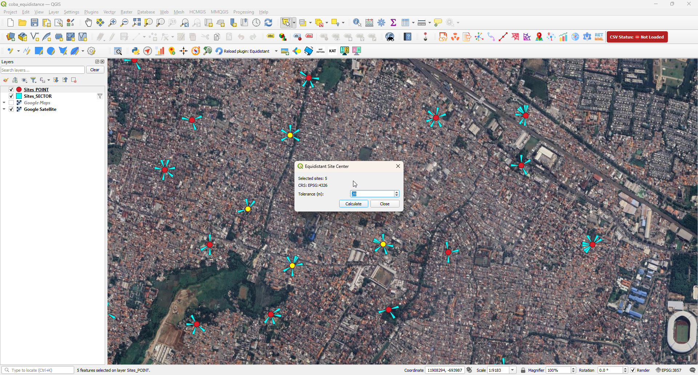
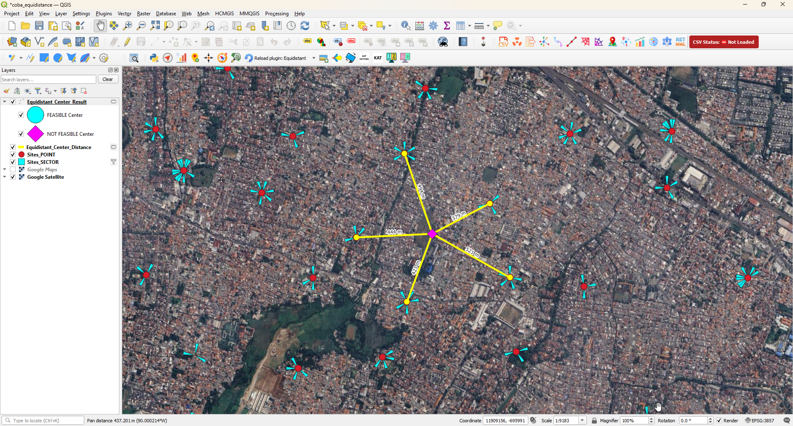
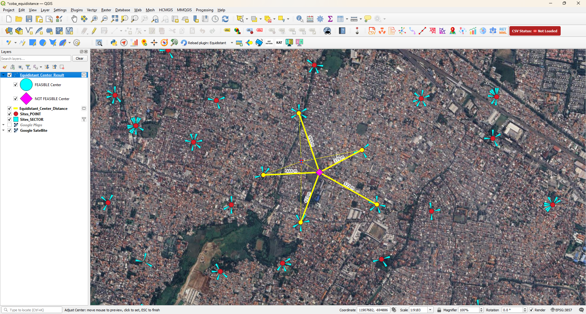

# Equidistant Site Center  
### Engineering-Grade Spatial Optimization for QGIS

Equidistant Site Center is an open-source QGIS plugin designed for RF engineers, telecom planners, and GIS analysts who require a spatially balanced center point derived from multiple site locations.

Unlike simple centroid calculations, this plugin applies a least-squares distance optimization approach to minimize distance variance across all selected sites.

Released under the MIT License.

---

## 🚀 Overview

In network planning and infrastructure deployment, selecting a center reference using geometric centroid methods can introduce spatial bias.

Equidistant Site Center computes a technically balanced center by minimizing radial deviation between the center and all selected site coordinates.

This produces a more neutral and engineering-relevant reference point for:

- RF planning
- Cluster hub analysis
- Infrastructure balancing
- Deployment feasibility assessment
- Spatial optimization workflows

---

## 🎯 Core Capabilities

- Least-Squares Equidistant Center Calculation
- Automatic projected CRS handling with UTM detection
- Radial Distance Mapping
- Interactive Center Adjustment Tool
- Real-time Visual Customization
- CRS-safe transformation pipeline

---

## 📸 Screenshots

---

## 📸 Workflow Overview

The plugin operates in a structured three-step workflow:

### 1️⃣ Calculation Setup

Input tolerance and initiate the least-squares optimization process.

---

### 2️⃣ Equidistant Center Result

Balanced center point computed using distance variance minimization.  
Radial deviation lines are generated for spatial analysis.

---

### 3️⃣ Interactive Center Adjustment

Manually refine the center position while maintaining real-time visual feedback.

---

---

## 🧠 How It Works

1. Select 2 or more point features in QGIS.
2. The plugin automatically detects an appropriate projected CRS.
3. Coordinates are transformed safely.
4. A least-squares optimization engine computes the balanced center.
5. Radial deviation lines are generated.
6. Results are displayed as memory layers inside the project.

The system is fully CRS-aware and handles global datasets reliably.

---

## 🛠 Technical Architecture

- Tested on QGIS 3.40 LTR
- Automatic UTM zone detection
- Memory-layer lifecycle control
- Stable toolbar lifecycle handling
- Visual settings applied without recalculation

This plugin is designed to behave as a stable engineering tool — not a prototype script.

---

## 🧩 Use Cases

- RF cluster balancing
- Hub location pre-feasibility study
- Site distribution evaluation
- Distance neutrality analysis
- Multi-site infrastructure planning

---

## 👨‍💻 Author

Achmad Amrulloh  
Telecom Engineer → Spatial Software Developer  

Released under the MIT License.

---

## ⚖️ Disclaimer

This tool assists spatial decision-making and should be used as a technical support system within professional engineering workflows.
